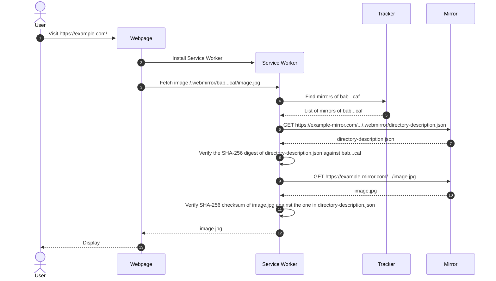

# WebMirror
WebMirror is a web-native\[1] protocol for secure\[2], decentralised\[3] access to files distributed across mirrors:

1. "Web-native" as in designed with HTTP and modern Web APIs in mind such as [Service Workers](https://developer.mozilla.org/en-US/docs/Web/API/Service_Worker_API) so that no additional software nor browser extensions are needed to access files.
2. Files are addressed by their SHA-256 hash of their content to ensure the authenticity of the data received from mirrors.
3. Files can be mirrored by anyone and users can retrieve files from any mirror; no party requires any permission from any authority.

## How it works

1. The User visits <http://example.com/>, i.e. "the Webpage".
2. The Webpage installs a service worker, i.e. "the Service Worker".
3. The Webpage, which embeds the Image `/.webmirror/bab...caf/image.jpg`, makes a request.
   * The request is intercepted by the Service Worker because the URL path of the request starts with `/.webmirror/`.
4. The Service worker asks the Tracker for the mirrors of `bab...caf`.
5. The Tracker responds.
6. The Service Worker requests `.../.webmirror/directory-description.json` from a mirror, "the Mirror".
7. The Mirror responds.
8. The Service Worker compares the SHA-256 digest of the `directory-description.json` that it just retrieved from the Mirror against `bab...caf` (i.e. the digest as in `/.webmirror/bab...caf/image.jpg`).
9. The Service Worker requests `.../image.jpg` from the Mirror.
10. The Mirror responds.
11. The Service Worker compares the SHA-256 digest of the `image.jpg` that it just retrieved from the Mirror against the digest in `directory-description.json`.
12. The Service Worker responds to the Webpage who requested the Image in step #3.
13. The Webpage displays the Image to the User.

## Development milestones

| Milestone       | Kinds of Directory Description | Support for File Pieces | Supported Hashes                      |
| :-------------- | :----------------------------- | :---------------------- | :------------------------------------ |
| **Milestone 1** | Deep                           | ❌ No                   | SHA-256                               |
| **Milestone 2** | Deep                           | ❌ No                   | SHA-256, SHA-384, SHA-512             |
| **Milestone 3** | Deep                           | ❌ No                   | MD5, SHA-1, SHA-256, SHA-384, SHA-512 |
| **Milestone 4** | Deep                           | ✅ Yes                  | MD5, SHA-1, SHA-256, SHA-384, SHA-512 |
| **Milestone 5** | Deep and Shallow               | ✅ Yes                  | MD5, SHA-1, SHA-256, SHA-384, SHA-512 |
