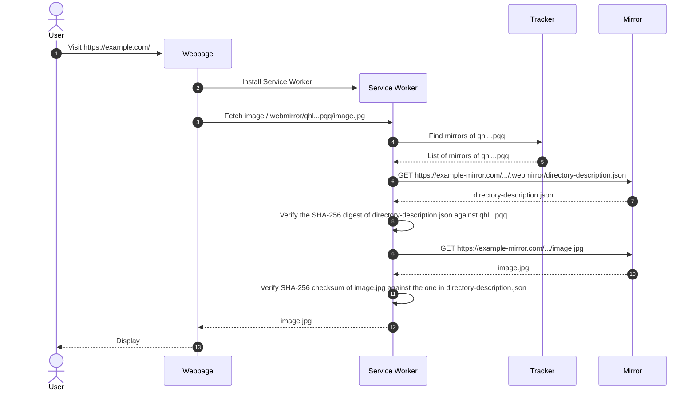

# WebMirror

WebMirror is a web-native\[1] protocol for secure\[2], decentralised\[3] access
to files distributed across mirrors:

1. "Web-native" as in designed with HTTP and modern Web APIs in mind such as
   [Service Workers](https://developer.mozilla.org/en-US/docs/Web/API/Service_Worker_API)
   so that no additional software nor browser extensions are needed to access
   files.
2. Files are addressed by their SHA-256 hash of their content to ensure the
   authenticity of the data received from mirrors.
3. Files can be mirrored by anyone and users can retrieve files from any mirror;
   no party requires any permission from any authority.

## Demo

<https://webmirror-demo.netlify.app/>

- Tracker: <https://tracker.webmirrors.org>
- Mirror #1: <https://wm-demo-1-assets.pages.dev>
- Mirror #2: <https://webmirror-demo.s3.eu-west-1.amazonaws.com>

> [!TIP]
> To inspect the HTTP requests made by the demo, use
> [Chromium](https://www.chromium.org/Home/) (or
> [Google Chrome](https://www.google.com/chrome/)) and:
>
> 1. Open a new tab.
> 1. Open **DevTools** <kbd>F12</kbd>.
> 1. Select **Network** tab in DevTools.
> 1. Select **Preserve log**.
>    - Required because the page reloads after the service worker is installed.
> 1. Visit https://webmirror-demo.netlify.app/ in the tab.
>
> HTTP requests whose **Initiator** is `webmirror.esm.js:*` are those made by
> the WebMirror Service Worker.
>
> If you want to see it again, delete all **on-device site data** before
> reloading since WebMirror caches files and tracker responses:
>
> 1. To the left of the web address, click **View site information** icon
>    .
> 1. Click **Cookies and site data**.
> 1. Click **Manage on-device site data**.
> 1. Click on the thrash icon to delete saved data.

## How it works



- For an example of `directory-description.json`, see
  [demo/directory/kismet/.webmirror/directory-description.json](./demo/directory/kismet/.webmirror/directory-description.json)

## Development milestones

| Milestone       | Kinds of Directory Descriptions | Support for File Pieces | Supported Hashes                      |
| :-------------- | :------------------------------ | :---------------------- | :------------------------------------ |
| **Milestone 1** | Deep                            | ❌ No                   | SHA-256                               |
| **Milestone 2** | Deep                            | ❌ No                   | SHA-256, SHA-384, SHA-512             |
| **Milestone 3** | Deep                            | ❌ No                   | MD5, SHA-1, SHA-256, SHA-384, SHA-512 |
| **Milestone 4** | Deep                            | ✅ Yes                  | MD5, SHA-1, SHA-256, SHA-384, SHA-512 |
| **Milestone 5** | Deep and Shallow                | ✅ Yes                  | MD5, SHA-1, SHA-256, SHA-384, SHA-512 |

### Kinds of directory descriptions

- **Deep**
  - A _deep_ directory description lists all files in a directory _recursively_.
- **Shallow**
  - A _shallow_ directory description lists files and sub-directories only in
    the current directory, without recursing into the sub-directories. The
    sub-directories themselves require their own descriptions as well.

Shallow descriptions are harder to browse because listing the contents of each
sub-directory requires an additional description to be retrieved and
cryptographically validated. However, some datasets are so large that listing
all of their content in a single file is impractical. For instance:

- Debian repositories contain 1,600,000+ files.
- English Wikipedia has 6,900,000+ articles.
- [OpenFreeMap](https://openfreemap.org/) has 28,300,000+ vector tiles.

Having a million files in a single description would mean:

- +52 bytes for the file digest (Base32 encoded SHA-256 digest)
- +9 bytes for the file size (assumed)
- +12 bytes for the file name (assumed)
- +23 bytes for JSON overhead

```math
\begin{align*}
&1,000,000 \times (52 + 9 + 12 + 23) \text{ bytes} \\
=\ &1,000,000 \times 96 \text{ bytes} \\
=\ &91.55 \text{ MiB}
\end{align*}
```

Having to download ~100 MiB of metadata first before you can start browsing the
content of a dataset is unacceptable in interactive use cases (e.g. using
OpenFreeMap display a map on a webpage). However, if files are organised into
directories&mdash;as is often already the case&mdash;then browsing them has much
smaller overhead using shallow descriptions.

<details>
<summary>Detailed example</summary>

For example, for a given top directory `my-dataset/`:

```
my-dataset/
├─ subdir-A/
│  ├─ file-A1.ext
│  └─ file-A2.ext
├─ subdir-B/
│  ├─ file-B1.ext
╵  └─ file-B2.ext
```

A **deep** description of `my-dataset/` directory would be:

```json
{
  "subdir-A/file-A1.ext": {
    "digest": "bab...faa",
    "size": 1024
  },
  "subdir-A/file-A2.ext": {
    "digest": "bab...fab",
    "size": 1024
  },
  "subdir-B/file-B1.ext": {
    "digest": "bab...fac",
    "size": 1024
  },
  "subdir-B/file-B2.ext": {
    "digest": "bab...fad",
    "size": 1024
  }
}
```

In contrast, a **shallow** description of `my-dataset/` directory would be:

```json
{
  "subdir-A/": {
    "type": "directory",
    "digest": "bab...daa"
  },
  "subdir-B/": {
    "type": "directory",
    "digest": "bab...dab"
  }
}
```

with sub-directories themselves also having descriptions; for example
`subdir-A/`:

```json
{
  "file-A1.ext": {
    "type": "file",
    "digest": "bab...faa",
    "size": 1024
  },
  "file-A2.ext": {
    "type": "file",
    "digest": "bab...fab",
    "size": 1024
  }
}
```

</details>

### Support for file pieces

Having a single hash digest for the entire file means that users cannot verify
the authenticity of data they retrieve from mirrors until they retrieve all. For
large files, this means that:

- WebMirror has to buffer all the data until it can verify their authenticity
  before returning them to the user, leading to increased memory usage.
- A dysfunctional/malicious mirror can provide large amounts of corrupt/wrong
  data, and WebMirror cannot tell until the very end.
- Users cannot make
  [range requests](https://developer.mozilla.org/en-US/docs/Web/HTTP/Range_requests)
  to retrieve parts of a file.
  - WebMirror currently emulates this by retrieving the entire file, verifying
    it, and slicing it afterwards.

### Supported hashes

SHA-256 is the default cryptographic hash function of WebMirror as its widely
supported in modern web browsers.

Support for SHA-384 and SHA-512 for files are planned in Milestone 2, as they
are part of the
[Subresource Integrity spec](https://w3c.github.io/webappsec-subresource-integrity/#hash-functions)
and enjoy widespread adoption.

MD5 and SHA-1 are "cryptographically broken and unsuitable for further use".
However, they've been used widely in the past (e.g.
[AWS S3](https://docs.aws.amazon.com/AmazonS3/latest/userguide/checking-object-integrity.html#checking-object-integrity-etag-and-md5)
and [Internet Archive](https://archive.org/developers/md-read.html)) and there
are vast amounts of data described by them. It's impractical to ask creators to
re-hash terabytes to petabytes of data just to adopt WebMirror, if they are
already comfortable using those hash functions today.

Directory descriptions to be designed with support for "parameterized" hash
functions in mind, such as `SHAKE256(M, d)` of SHA-3 where `d` is the output
size in bits. However, there are no plans in near future to support any other
hash functions besides the one listed in the table above.
