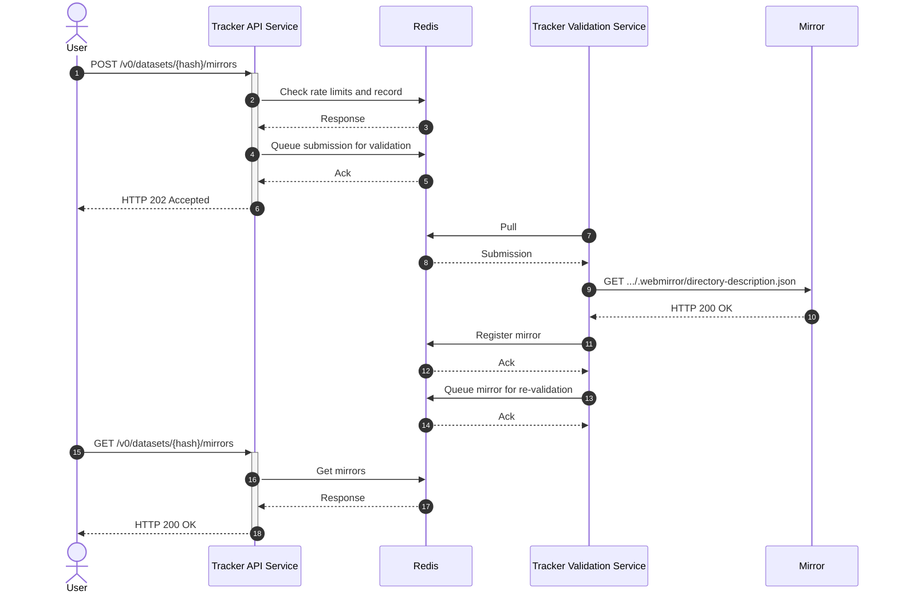

# webmirror-tracker Architecture

WebMirror is a web-native protocol for secure, decentralised access to files
distributed across mirrors.

Trackers help Clients to discover Mirror Servers for a given dataset.

webmirror-tracker is a free software for WebMirror Trackers. It currently powers [tracker.webmirrors.org](https://tracker.webmirrors.org/), a freely available Tracker maintained by the WebMirror project for public use.

This document describes the architecture of webmirror-tracker.

## High-level sequence diagram

## High-level API
* `GET /v0/datasets/{hash}/mirrors` &mdash; List mirrors of a dataset
* `POST /v0/datasets/{hash}/mirrors` &mdash; Register a mirror of a dataset

### List dataset mirrors endpoint
The GET endpoint responds with a JSON-encoded list of mirrors for the requested
dataset. The [`Access-Control-Allow-Origin` header](https://developer.mozilla.org/en-US/docs/Web/HTTP/Headers/Access-Control-Allow-Origin) is set to wildcard (`*`) to allow any
origin to read the response.

### Register dataset mirror endpoint
The POST endpoint accepts a JSON-encoded body, containing the URL of the mirror
requested to be registered for the given dataset. The tracker responds with HTTP
[202 Accepted](https://developer.mozilla.org/en-US/docs/Web/HTTP/Status/202) to
indicate that the request has been accepted for processing. Afterwards, the
tracker will contact the mirror to validate that it is indeed hosting the
dataset, as claimed in the request.

Trackers re-validate registrations periodically, to make sure that mirrors are
up and still hosting datasets.

### Security
WebMirror trackers are a public service (like BitTorrent trackers) so the API
has no authentication.

POST requests are rate-limited by client IP to 1 request per second by default.
IPv6 addresses are rate-limited in /64 blocks.

TODO: How can we prevent clients using WebMirror trackers as proxies for
launching small-scale denial-of-service attacks? Perhaps a way for hosts/mirrors
to indicate that they _might_ be hosting some WebMirror datasets (e.g. presence
of a file at `/.well-known/webmirror/trackers.txt`)? I guess the current
rate-limiting prevents that to a certain extent.

## See also
* [WebMirror Tracker OpenAPI Spec](https://webmirror.github.io/webmirror/tracker/openapi-spec)
