# webmirror-tracker Architecture

WebMirror is a web-native protocol for secure, decentralised access to files
distributed across mirrors.

Trackers help Clients to discover Mirror Servers for a given dataset.

webmirror-tracker is a free software for WebMirror Trackers. It currently powers [tracker.webmirrors.org](https://tracker.webmirrors.org/), a freely available Tracker maintained by the WebMirror project for public use.

This document describes the architecture of webmirror-tracker.

## High-level sequence diagram

```mermaid
sequenceDiagram
    autonumber
    actor User
    User ->>+Tracker API Service: POST /v0/datasets/{hash}/mirrors
    Tracker API Service ->> Redis: Check rate limits and record
    Redis -->> Tracker API Service: Response
    Tracker API Service ->> Redis: Queue submission for validation
    Redis -->> Tracker API Service: Ack
    Tracker API Service -->>-User: HTTP 202 Accepted
    Tracker Validation Service ->> Redis: Pull
    Redis -->> Tracker Validation Service: Submission
    Tracker Validation Service ->> Mirror: GET .../.webmirror/directory-description.json
    Mirror -->> Tracker Validation Service: HTTP 200 OK
    Tracker Validation Service ->> Redis: Register mirror
    Redis -->> Tracker Validation Service: Ack
        Tracker Validation Service ->> Redis: Queue mirror for re-validation
    Redis -->> Tracker Validation Service: Ack
    User ->>+ Tracker API Service: GET /v0/datasets/{hash}/mirrors
    Tracker API Service ->> Redis: Get mirrors
    Redis -->> Tracker API Service: Response
    Tracker API Service -->>- User: HTTP 200 OK
```

## See also
* [WebMirror Tracker OpenAPI Spec](https://webmirror.github.io/webmirror/tracker/openapi-spec)
